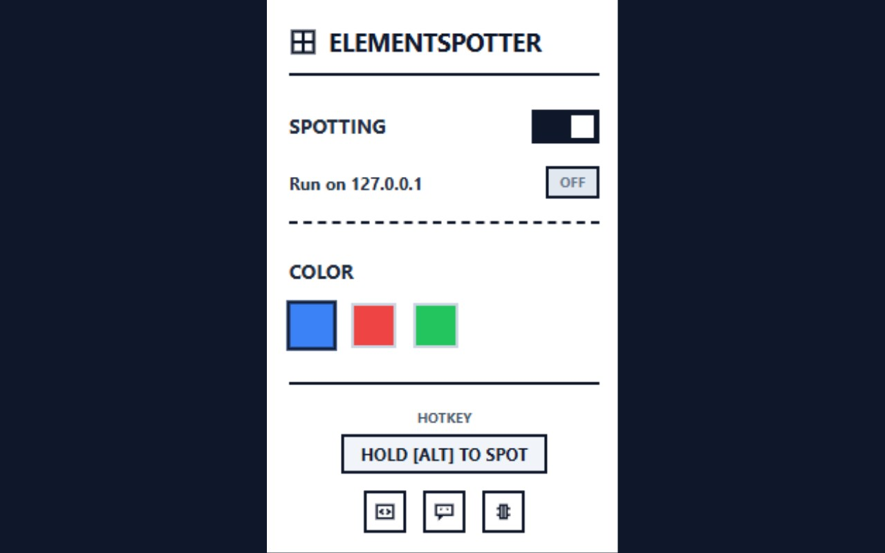
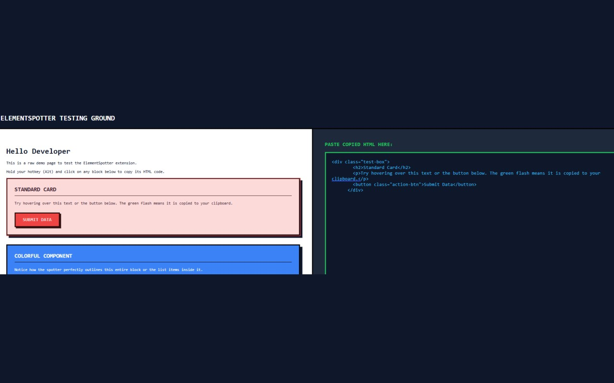
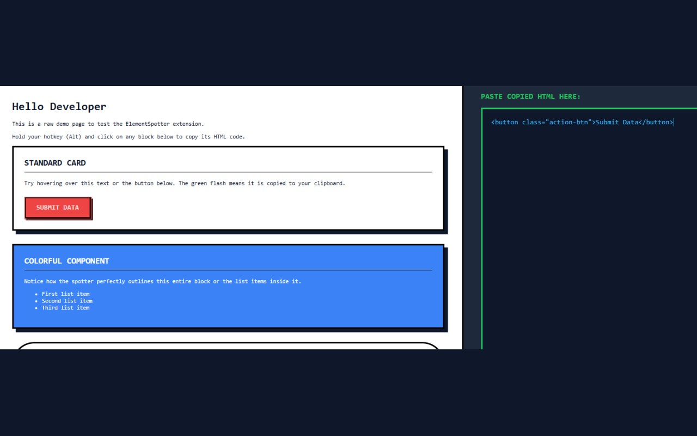
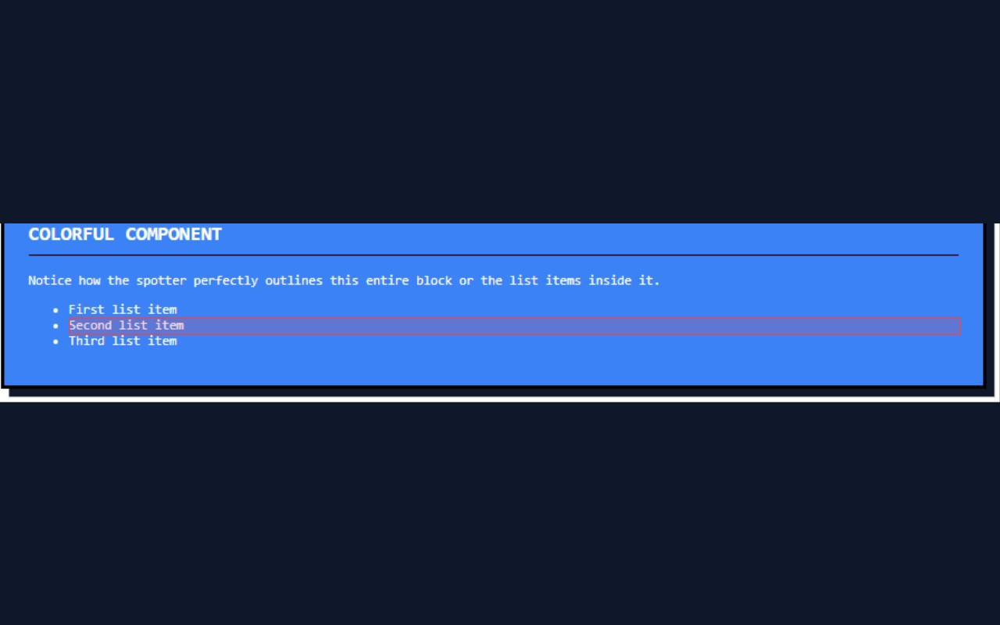

# Elementspotter

a lightweight chrome extension that lets you copy raw html elements instantly by just holding alt and clicking. 

i built this because i got tired of constantly opening inspect element just to copy a single button or div structure. with elementspotter, you just point, hold alt, click, and paste it into your editor.

## features

- **instant copy**: hold alt and click any element to copy its html.
- **domain filtering**: only want it on specific sites? use the whitelist mode. want it everywhere except a few sites? use blacklist mode.
- **custom highlight**: change the highlight color to whatever fits your eyes.
- **brutalist ui**: no bloated design, just raw and functional settings menu.

## how to install from source

if you want to run it locally or modify the code:

1. clone this repository
2. run `pnpm install`
3. run `pnpm run build` or `pnpm dev`
4. open chrome and go to `chrome://extensions/`
5. turn on "developer mode" at the top right
6. click "load unpacked" and select the `build/chrome-mv3-dev` (or prod) folder.

## how to use

by default, you need to enable it for specific domains first.
1. click the extension icon in your browser.
2. add the current website to the whitelist.
3. go back to the webpage, hold `Alt`, and hover over anything.
4. click to copy.

## tech stack

- plasmo framework
- react
- tailwindcss (brutalist style)

## contributing

feel free to open an issue or submit a pull request if you find any bugs or want to add a new feature.
